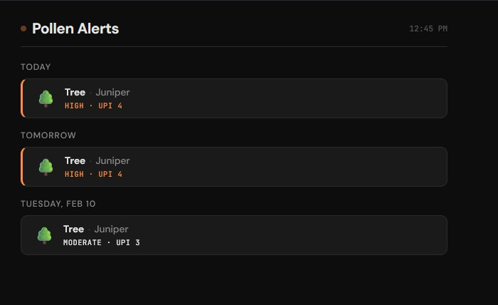

# Pollen Alerts for Dakboard

A lightweight, self-contained HTML page that pulls pollen forecast data from the [Google Pollen API](https://developers.google.com/maps/documentation/pollen) and displays **High** and **Very High** alerts on a [Dakboard](https://dakboard.com) display using the **Widget Block** under Graphs & External Data.

  



## Features

- 🌾 Displays **Grass**, **Tree**, and **Weed** pollen alerts at High (UPI 4) or above
- 🌳 Shows individual plant species contributing to elevated levels
- 🔄 Auto-refreshes on a configurable interval (default: 60 minutes)
- ✅ Green "all clear" indicator when nothing is elevated
- 🎨 Dark theme designed for always-on Dakboard displays
- 📦 Single HTML file — no build tools, no frameworks, no backend

## Prerequisites

- A [Google Cloud](https://console.cloud.google.com/) project with the **Pollen API** enabled
- A Google Pollen API key ([setup guide](https://developers.google.com/maps/documentation/pollen/cloud-setup))
- A Dakboard paid subscription (required for Custom Screens and Widget Blocks)

## Quick Start

### 1. Clone the repo

```bash
git clone https://github.com/thedownwardspiral/pollen-dakboard.git
cd pollen-dakboard
```

### 2. Configure

Open `pollen-dakboard.html` and edit the `CONFIG` block near the bottom of the file:

```javascript
const CONFIG = {
  API_KEY: 'YOUR_GOOGLE_POLLEN_API_KEY',  // Your API key
  LAT: 29.420420,                          // Your latitude
  LNG: -98.483670,                         // Your longitude
  DAYS: 3,                                 // Forecast days (1–5)
  MIN_UPI: 4,                              // Minimum UPI to alert (4=High, 5=Very High)
  REFRESH_MINUTES: 60,                     // Auto-refresh interval
  SHOW_PLANTS: true,                       // Show individual plant species
};
```

| Parameter | Default | Description |
|-----------|---------|-------------|
| `API_KEY` | — | Your Google Pollen API key |
| `LAT` / `LNG` | `29.420420` / `-98.483670` | Location coordinates ([find yours](https://www.latlong.net/)) |
| `DAYS` | `3` | Number of forecast days (max 5) |
| `MIN_UPI` | `4` | Minimum UPI threshold. `3` = Moderate+, `4` = High+, `5` = Very High only |
| `REFRESH_MINUTES` | `60` | How often to re-fetch data. `0` disables auto-refresh |
| `SHOW_PLANTS` | `true` | Display individual species names alongside pollen type |

### 3. Add to Dakboard

This project uses the **Widget Block** found under **Graphs & External Data** in the Dakboard Custom Screen editor.

1. Open your Dakboard **Custom Screen** editor
2. Click **Add a Block** and search for **Widget** (under the *Graphs & External Data* section)
3. Click the pencil icon to edit the block
4. Copy the full contents of `pollen-dakboard.html` and paste it into the widget's code editor
5. Size and position the block on your screen
6. Save your changes

> **Note:** The Widget Block runs JavaScript in a sandboxed environment directly on your Dakboard screen — no external hosting required. The widget auto-refreshes within the block based on the `REFRESH_MINUTES` value in the config. Dakboard also performs its own 6-hour full screen refresh.

## UPI Scale Reference

The [Universal Pollen Index](https://developers.google.com/maps/documentation/pollen/pollen-index) (UPI) runs from 0–5:

| UPI | Category | Displayed? (default) |
|-----|----------|---------------------|
| 0 | None | No |
| 1 | Very Low | No |
| 2 | Low | No |
| 3 | Moderate | No (set `MIN_UPI: 3` to include) |
| 4 | **High** | ✅ Yes |
| 5 | **Very High** | ✅ Yes |

## Security Note

Your API key is embedded in the widget code stored in your Dakboard account. While it isn't publicly exposed like a hosted webpage, it's still good practice to restrict it:

1. In the [Google Cloud Console](https://console.cloud.google.com/apis/credentials), restrict your API key:
   - **API restriction** → Pollen API only
2. Set a reasonable quota/budget alert on the API

## Customization

The page uses CSS variables at the top of the `<style>` block for easy theme adjustments:

```css
:root {
  --bg: #0d0d0d;            /* Page background */
  --surface: #1a1a1a;       /* Card background */
  --surface-border: #2a2a2a; /* Card borders */
  --text-primary: #e8e8e8;  /* Main text */
  --accent-high: #ff8c42;   /* High alert color (orange) */
  --accent-veryhigh: #e63946; /* Very High alert color (red) */
  --accent-clear: #4ecdc4;  /* All-clear color (teal) */
}
```

## License

MIT
